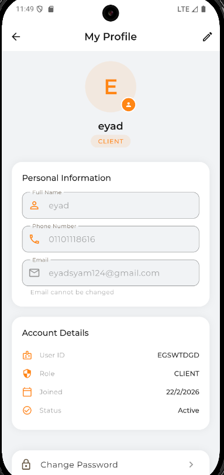

<p align="center">
  
</p>

# Edita Logistics - The Ultimate Fleet Management Companion

Edita Logistics is a smart, real-time application designed to streamline shipment delivery, tracking, and fleet management. It brings together powerful Mapbox routing algorithms with real-time Firebase synchronization to provide a seamless "Uber-like" experience for both drivers and clients.

## 🚀 Key Features
- **Real-Time Tracking**: Monitor shipments live on the map. Shows driver location natively and dynamically visualizes the best route to the destination.
- **Smart Routing**: Calculates the shortest path, estimated time of arrival (ETA), and distance dynamically using Mapbox Directions API.
- **Driver-Client Synchronization**: Continuous location sharing from the driver securely delivered to clients waiting for their shipments via Firebase Streams.
- **Dynamic Polylines**: The map redraws the optimal road-based polyline directly to the destination once the driver starts moving.
- **Role-Based Workflows**: Tailored user experiences depending on the authenticated role (Admin, Driver, or Client).
- **Offline Queuing**: Gracefully handle disconnected moments with Hive local storage caching.
- **Stunning UI**: A gorgeous, animated light theme adorned with Edita's signature orange branding.

## 🛠️ Technology Stack
- **Frontend**: Flutter & Dart.
- **State Management**: Riverpod (`flutter_riverpod`) for reactive dependencies.
- **Backend & Auth**: Firebase Auth and Cloud Firestore (NoSQL Document DB).
- **Local Database**: Hive for secure token and preference caching.
- **Navigation**: `go_router` for robust inner and deep routing.
- **Maps**: `mapbox_maps_flutter` for native high-performance rendering.
- **Location Services**: `geolocator` for background pulsing and position fetching.

## 📱 App Screenshots
Experience the modern design and fluid animations of Edita Logistics with live car mapping, stunning bottom sheets, and interactive snackbars.

<table align="center">
  <tr>
    <td align="center"><br><b>Log In</b></td>
    <td align="center"><br><b>Client Home</b></td>
    <td align="center"><br><b>Driver Home</b></td>
    <td align="center"><br><b>New Shipment</b></td>
  </tr>
  <tr>
    <td align="center"><br><b>Live Tracking (Client)</b></td>
    <td align="center"><br><b>Live Tracking (Driver)</b></td>
    <td align="center"><br><b>User Profile</b></td>
    <td align="center"><br><b>Sign Up</b></td>
  </tr>
</table>

## 🏁 Getting Started
1. Clone the repository:
```bash
git clone https://github.com/eyadsyam/logistics_management.git
```

2. Install dependencies:
```bash
flutter pub get
```

3. Run code generation for Freezed models:
```bash
dart run build_runner build --delete-conflicting-outputs
```

4. Run the app:
```bash
flutter run
```

## 🤝 Contributing
Contributions are welcome! Please fork the repository and submit a pull request for any enhancements or bug fixes.
